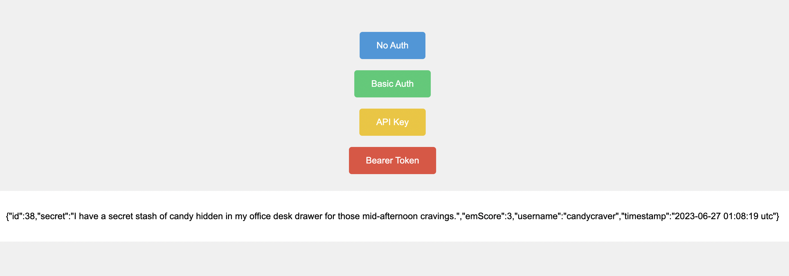

# API Authentication Practice (Secrets API)

This project is a Node.js/Express application designed to demonstrate the four most common methods of API authentication using **Axios**. It interacts with the [AppBrewery Secrets API](https://secrets-api.appbrewery.com/).

## 🎯 Project Goal

To practice sending HTTP requests with different security protocols:
1.  **No Authentication:** Public endpoints.
2.  **Basic Authentication:** Sending a username and password (encoded automatically by Axios).
3.  **API Key:** Sending a specific key via query parameters.
4.  **Bearer Token:** Sending a token via the Authorization header.




## 🛠️ Tech Stack

* **Node.js**: Runtime environment.
* **Express**: Server framework.
* **Axios**: For making HTTP requests to the external API.
* **EJS**: Templating engine to render the API responses.

## ⚙️ Setup & Installation

1.  **Clone the repository:**
    ```bash
    git clone https://github.com/katecim/api-authentication-methods.git
    ```

2.  **Install dependencies:**
    ```bash
    npm install
    ```
    *(Note: Ensure your `package.json` includes `express`, `axios`, and `ejs`. Since the code uses `import` statements, ensure `"type": "module"` is set in your package.json).*

3.  **Get Credentials:**
    To use this app, you need credentials from the Secrets API.
    * Visit the [Secrets API Documentation](https://secrets-api.appbrewery.com/).
    * You will need to use a tool like Postman to POST to `/register` to generate your `username` and `password`.
    * Use those credentials to POST to `/get-api-key` and `/get-token`.

4.  **Configure the App:**
    Open `index.js` and fill in the empty string variables at the top of the file:

    ```javascript
    const myUsername = "YOUR_USERNAME";
    const myPassword = "YOUR_PASSWORD";
    const myAPIKey = "YOUR_API_KEY";
    const myBearerToken = "YOUR_BEARER_TOKEN";
    ```

## 🚀 Usage

1.  Start the local server:
    ```bash
    node index.js
    ```
2.  Open your browser and go to: `http://localhost:3000`
